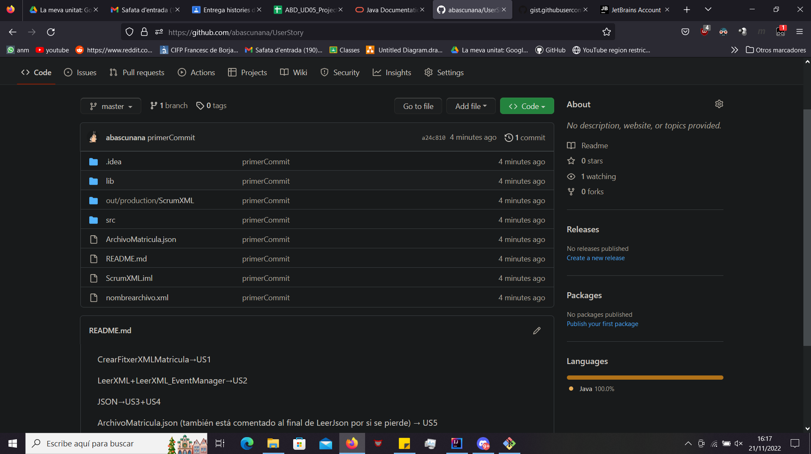

CrearFitxerXMLMatricula→US1

LeerXML+LeerXML_EventManager→US2

JSON→US3+US4

ArchivoMatricula.json (también está comentado al final de LeerJson por si se pierde) → US5

LeerArchivo.json → US6

1.inicialización git y push del repositorio local

2.Archivos proyecto

3.Resultado al hacer el push

